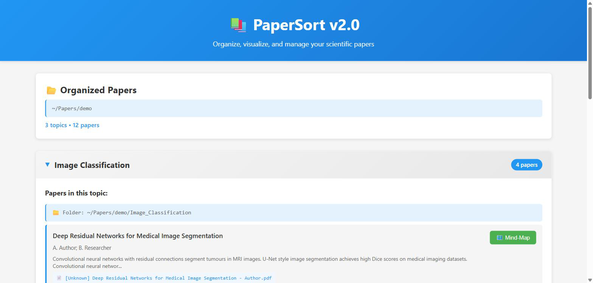

# PaperSort v2.0

🧠 AI-Powered Academic Paper Organizer with Intelligent Mind-Maps

PaperSort automatically organizes your research papers by topic and generates insightful mind-maps and summaries using local AI.



## ✨ Features

### 📁 Smart Organization
- **Automatic Topic Classification**: AI analyzes papers and groups them by research area
- **Copy or Move Mode**: Keep originals intact or organize in place
- **Metadata Extraction**: Automatically extracts titles, authors, abstracts

### 🧠 Mind-Map Visualization
- **Visual Paper Structure**: See methodology, contributions, and results at a glance
- **Interactive SVG**: Beautiful, scalable mind-map diagrams
- **AI-Powered Analysis**: Uses local LLM for intelligent structure extraction

### 📝 Intelligent Summaries
- **Analytical Insights**: Goes beyond extraction to provide synthesis and interpretation
- **Comprehensive Coverage**: Problem statement, methodology, results, and significance
- **WHY and HOW**: Explains reasoning and impact, not just what was done

### 🔒 Privacy-First
- **100% Local Processing**: All AI runs on your machine via Ollama
- **No Cloud Dependencies**: Your research stays private
- **Offline Capable**: Works without internet connection

## 🚀 Quick Start

### Installation

1. **Download** the latest release:
   - [PaperSort-2.0.0-arm64.dmg](https://github.com/rcwang2024/PaperSort/releases)

2. **Install**:
   - Open the DMG file
   - Drag PaperSort to Applications folder
   - Launch PaperSort

3. **First Run Setup**:
   - PaperSort will automatically check for dependencies
   - Click "Auto Install" to install required dependencies (~5 minutes)
   - Optionally install Ollama for AI features

That's it! 🎉

## 📋 Requirements

### Required (Auto-installed)
- macOS 10.12+ (Apple Silicon)
- Python 3.11+
- Graphviz

### Optional (Recommended)
- Ollama (for AI-powered features)

## 🎯 Usage

### Organize Papers

1. Click **"Choose Folder"** and select your papers directory
2. Enable **"Copy Mode"** to keep originals safe
3. Click **"Organize Papers"**
4. PaperSort analyzes and categorizes your papers

### View Mind-Maps

1. Click the **🧠 icon** next to any paper
2. Explore the interactive visualization
3. Read the AI-generated summary

### Export Results

- Organized papers are saved to timestamped folders
- Mind-maps can be downloaded as SVG
- Summaries are accessible from the UI

## 🛠️ For Developers

### Prerequisites

```bash
# Install Node.js and npm
brew install node

# Install Python dependencies
pip3 install fastapi uvicorn pydantic aiosqlite httpx graphviz

# Install Graphviz
brew install graphviz

# Optional: Install Ollama
brew install ollama
ollama pull llama3.2:3b
```

### Development

```bash
# Clone repository
git clone https://github.com/rcwang2024/PaperSort.git
cd PaperSort

# Install frontend dependencies
cd frontend && npm install && cd ..

# Run in development mode
npm run electron:dev
```

### Build Distribution

```bash
# Build DMG for distribution
npm run build

# Output: dist-installer/PaperSort-2.0.0-arm64.dmg
```

## 📖 Documentation

- **[How It Works](HOW_IT_WORKS.md)** - Technical architecture and dependency system
- **[Distribution Guide](DISTRIBUTION.md)** - Advanced build and packaging options
- **[User Guide](README_FOR_USERS.md)** - Quick start for end users

## 🤝 Contributing

Contributions are welcome! Please feel free to submit a Pull Request.

1. Fork the repository
2. Create your feature branch (`git checkout -b feature/AmazingFeature`)
3. Commit your changes (`git commit -m 'Add some AmazingFeature'`)
4. Push to the branch (`git push origin feature/AmazingFeature`)
5. Open a Pull Request

## 📝 License

This project is licensed under the MIT License - see the [LICENSE](LICENSE) file for details.

## 🙏 Acknowledgments

- **Ollama** - Local LLM inference
- **Graphviz** - Graph visualization
- **FastAPI** - Modern Python web framework
- **Electron** - Cross-platform desktop apps
- **React** - UI framework

## 📧 Contact

Ruichao Wang - [@rcwang2024](https://github.com/rcwang2024)

Project Link: [https://github.com/rcwang2024/PaperSort](https://github.com/rcwang2024/PaperSort)

---

⭐ If you find PaperSort useful, please consider giving it a star!
